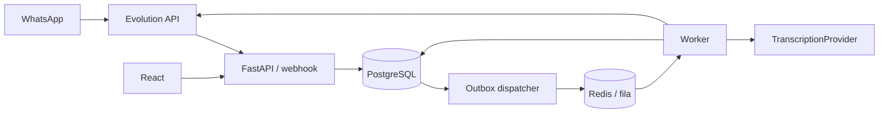

# Arquitetura

## Organização

Monólito modular com processos API e worker construídos a partir do mesmo código. PostgreSQL é a fonte de verdade. Redis transporta tarefas e serve cache e limites de requisição; perda do Redis não pode eliminar mensagens já recebidas. Evolution API é um adapter de canal, sem regras financeiras.



## Estrutura de implementação proposta

```text
backend/
  app/
    main.py
    core/                 # configuração, auth, banco, dinheiro, relógio
    modules/
      identity/           # tenants, famílias, membros, sessões
      ledger/             # transações, contas, cartões, faturas
      categorization/
      conversations/
      ingestion/          # webhook, áudio, imports
      reconciliation/
      planning/           # orçamento, metas, recorrências
      analytics/
      notifications/
      integrations/
    workers/
  migrations/versions/
  tests/{unit,integration,contract,e2e}/
frontend/src/{app,features,components,lib}/
infra/
docs/
```

Cada módulo contém domain, application, infrastructure e api quando necessário. Rotas chamam casos de uso; casos de uso controlam transações; repositories não fazem commits independentes. Nenhum módulo chama diretamente HTTP de outro módulo local. Analytics lê projeções do ledger; adapters traduzem modelos externos para contratos internos.

## Consistência e eventos

Na mesma transação SQL: validar permissão, bloquear agregados afetados, conferir versão, gravar ledger, origem, auditoria, estado da pendência e outbox. Consumidores usam inbox/processed-event para idempotência. Eventos: TransactionCreated, TransactionUpdated, TransactionDeleted, TransactionReconciled, InvoicePaid, BudgetThresholdReached. Envelope: event_id, event_type, schema_version, tenant_id, household_id, aggregate_id, aggregate_version, occurred_at, correlation_id, payload mínimo.

Dispatcher lê outbox com bloqueio e SKIP LOCKED, enfileira event_id e marca entrega. Uma falha entre enqueue e marcação causa reenvio tolerado pelo consumidor. Um processo de recuperação reenfileira eventos sem processamento confirmado. Entrega interna pelo menos uma vez; efeito financeiro uma vez por chave idempotente. Não prometer exactly-once na entrega WhatsApp quando o provider não oferecer idempotência.

## Concorrência e falhas

Serializar processamento por ConversationSession com lock SQL e sequência de mensagens. Jobs longos de transcrição rodam fora do lock; seus resultados voltam à ordem original. Timeout de áudio permite perguntar novamente sem travar indefinidamente a conversa. Redis lock pode otimizar, mas não substitui constraints e locks do PostgreSQL.

Chamadas externas acontecem fora da transação financeira. Retentar erros transitórios com backoff, jitter e limite; erros permanentes vão para revisão. Se envio de sucesso falhar, a transação permanece confirmada e a mensagem de saída é retentada. Se transcrição falhar, não criar despesa.

## Contratos de adapters

- TranscriptionProvider.transcribe(audio, mime_type) → TranscriptionResult.
- MessageChannel.send(recipient, text, client_message_id) → DeliveryResult.
- FinancialDataProvider.connect/sync/get_accounts/get_balances/get_transactions/get_cards/get_investments.
- FinancialParser.parse(normalized_text, context) → StructuredCandidate.
- Clock.now() e UnitOfWork permitem testes determinísticos.

Fornecedores não recebem autoridade de persistência. Versão dos contratos externos deve ser fixada na implementação, acompanhada de fixtures e teste de integração; este documento não presume formato específico de release.

## Operação

Compose de desenvolvimento: postgres, redis, api, worker, frontend; Evolution opcional em profile separado. Health liveness sem dependências e readiness com banco/fila. Migrações executadas uma vez antes do rollout, não por cada worker. Backup periódico e ensaio de restore. Logs estruturados por correlation_id; métricas de fila, tempo pendente, erros por adapter e outbox atrasada. Alertar processamento parado mesmo que a API esteja saudável.
